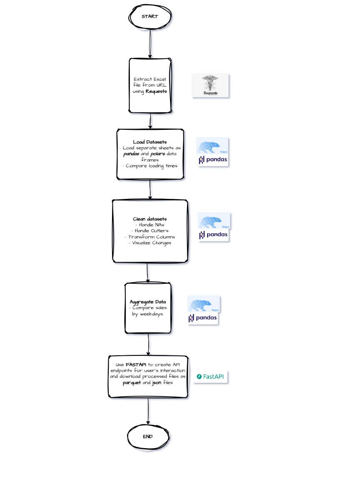
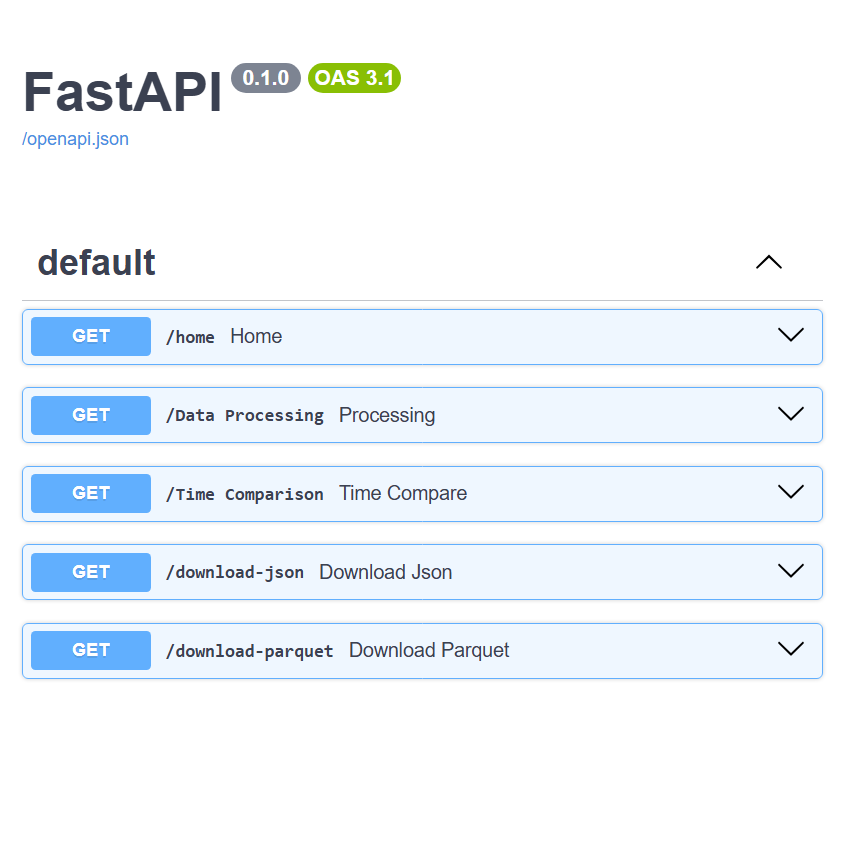

# **Project: Data Processing API**

## Goal:
The goal of this project is to build FastAPI-based web service that processes large datasets using **Polars** and **Pandas**.

The service should:
- Load, clean, and aggregate data.
- Expose a FastAPI endpoint to return processed results.
- Write results to a JSON or Parquet file.

You will compare **Polars** and **Pandas** performance, handle missing values,
and test the API via the interactive `/docs` interface.

## **Project Structure**
```
data_api/
    ├── .gitignore
    ├── README.md
    ├── main.py
    ├── pyproject.toml
    ├── poetry.lock
    ├── data_processing_map.jpg
    ├── online_retail_ii.xlsx
    ├── processor/
    │   ├── __init__.py
    │   ├── url_load.py
    │   ├── load_data.py
    │   ├── clean.py
    │   ├── aggregate.py
    └── tests/
        ├── __init__.py
        └── test_processor.py
```

### PROJECT MAP


### **FEATURES**
1. **FastAPI Endpoint**: A POST endpoint that loads, cleans, and aggregates dataset information.
2. **Dependency Management**: Use Poetry for package management.
3. **Virtual Environment**: Use `venv` for isolated Python environments.
4. **Data Processing**: Efficiently handle large datasets with **Polars** and **Pandas**.
5. **Data Cleaning**: Handle missing values, outliers, and incorrect formatting.
6. **File Handling**: Save processed results in JSON and Parquet formats.
7. **API Documentation**: Use Swagger UI (`/docs`) for interactive testing.

### **Set Up Environment**
1. Initialize a Python project using **Poetry**.
 - `cd path` Move to the main directory you want to use for the project.
 - `poetry new data-processing-api --name processor` This creates the project folder. 
 - `poetry env use python(version)` This chooses the python version you want to use and also automatically creates a virtual environment for you.
 - `poetry add package1 package2` Add main dependencies using this. 
 - `poetry add group --vizs package1 package2` Use this to add visualization dependencies.


### **Clone Repository**
Clone the repository using `git clone https://github.com/Iyanuvicky22/Projects.git`


### **Run Project**
1. From the terminal run `fastapi dev main.py`

### **FastAPI EndPoints**
```
GET/home "Welcome Message"
GET/Data Processing "Processing"
GET/Time Comparison "Time Compare"
GET/download-json "Download Json"
GET/download-parquet "Download Parquet"
```


## Dependencies
#### Main Dependencies
`fastapi` (>=0.115.8,<0.116.0)",
`polars` (>=1.23.0,<2.0.0)",
`pandas` (>=2.2.3,<3.0.0)",
`openpyxl` (>=3.1.5,<4.0.0)",
`requests` (>=2.32.3,<3.0.0)"

#### Visualization Dependencies
[tool.poetry.group.vizs.dependencies]
`matplotlib` = "^3.10.1"
`seaborn` = "^0.13.2"
`plotly` = "^6.0.0"

#### Code Formating Dependency
[tool.poetry.group.dev.dependencies]
`black` = "^25.1.0"

### Author: Arowosegbe Victor Iyanuoluwa
